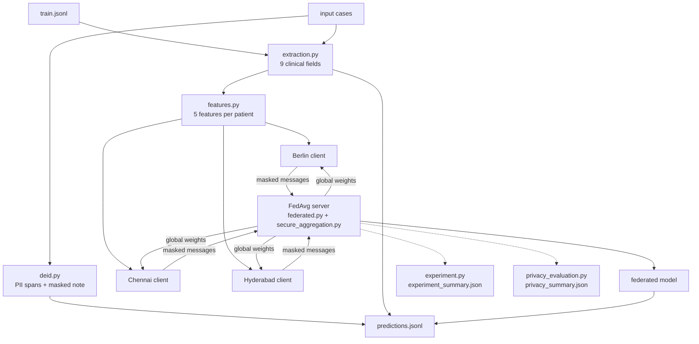

# REPORT

## 1. Executive summary

This project solves the four tasks: rule-based de-identification, rule-based structured extraction, a model trained with basic horizontal federated learning (FedAvg with a central server that aggregates the updates), and secure aggregation as the privacy extension.

On the 30 validation cases, de-identification went from 0.73 to 1.00 with no PII leaked, and structured extraction from 0.88 to 1.00; the automated points went from 31.8 to 37.6 out of 40. For readmission, I compared local, federated and centralized models using the same model and features. In cross-validation the federated model (AUC 0.87) is as good as the centralized one and better than the local models (0.83), and every hospital gains from it. Secure aggregation hides each hospital's numbers from the server without changing the model.

It was my first time working with secure aggregation, and I spent some extra time reading about other security mechanisms for federated learning, like differential privacy and homomorphic encryption. I found it all interesting. Even though the AI implemented the major parts of the code, working through it step by step was interesting.

Time spent: understanding the project and planning 1 hour, de-identification 2 hours, extraction 1.5 hours, federated learning 2 hours, privacy extension 3 hours.

## 2. System architecture

`run_submission.py` runs the whole pipeline with the standard command. Each task has its own module in `src/`, and the readmission part is split into hospital-side and server-side code, so it is clear what data stays at each hospital.
Below is a flowchart generated by Claude:

| Module | What it does |
|---|---|
| `src/deid.py` | Finds the 8 PII labels with regex and context rules and renders the masked note (task 1). |
| `src/extraction.py` | Synonym dictionaries, negation handling, unit conversion, smoking and allergy rules (task 2). |
| `src/features.py` | Turns a case into the 5 model features and computes the feature totals used for scaling. |
| `src/model.py` | The numpy logistic regression shared by the local, federated and centralized models. |
| `src/federated.py` | Hospital clients that keep their rows private, the FedAvg server loop, and the centralized reference (task 3). |
| `src/secure_aggregation.py` | Diffie-Hellman key agreement, fixed-point encoding and pairwise masking (task 4). |
| `src/experiment.py` | Runs local vs federated vs centralized with cross-validation and validation, and writes `experiment_summary.json`. |
| `src/privacy_evaluation.py` | Compares plain and secure FedAvg (utility, runtime, what the server sees) and writes `privacy_summary.json`. |

For each input case, the prediction file gets the PII spans and masked note from `deid.py`, the extracted fields from `extraction.py`, and the readmission probability from the federated model. The model is trained on the training file at run time, so the same command works on the hidden input file, where no labels are available.

The Docker image uses Python 3.11 (`python:3.11-slim-bookworm`) with pinned package versions, and its entry point accepts the standard arguments. A `.dockerignore` keeps the local virtual environment, Git history and outputs out of the image.

## 3. De-identification

In this step, the goal is to find the personal information (PII) in each clinical note and replace it with a placeholder such as `[PATIENT_NAME]`, while keeping the clinical content readable. The starter code already detected 5 of the 8 labels: patient ID, date of birth, encounter date, phone number and email (the emails in this dataset belong to clinicians, not patients). It had no code at all for patient names, clinician names and addresses, so on the validation set it missed all 105 of those spans and leaked 45.7% of the PII characters.

### Starting point

First, I pushed the challenge files to GitHub as they were, updated Python to 3.11 (the version used in the Dockerfile), created a virtual environment and installed the requirements. Then I ran `make evaluate` on the starter to confirm the setup works and to get a baseline:

| Metric (validation, 30 cases) | Starter | After my changes |
|---|---:|---:|
| De-identification score | 0.7279 | **1.0000** |
| PII characters leaked | 45.7% | **0%** |
| Structured extraction score | 0.8797 | 0.8797 (improved in section 4) |
| Readmission prediction score | 0.7727 | 0.7727 (not changed yet) |
| Automated points | 31.84 / 40 | 35.92 / 40 (after this task only) |

### Method: rule-based detection

I chose a rule-based approach (regex patterns plus context rules) instead of a trained model. The notes follow a small number of templates per hospital, there are only 120 labelled training notes, the evaluation runs without GPU or network access, and the challenge description (`ORIGINAL_CHALLENGE_README.md`) states that a simple, well-tested solution will be enough. I moved the de-identification code from `src/baseline.py` into its own module, `src/deid.py`, to make the project modular, and to solve every task in a separate file.

Each rule handles two major things, what does the value look like (its shape), and what words around it can help with confirming it is PII (its context). Emails, IDs, dates and phone numbers have a fixed shape, so the shape is almost enough. But on the other hand, names and addresses don't have a fixed format, which is the main challenge: they need several patterns, and they need context (surrounding words to help with detection). The other challenge is that the rules should not only fit the public data. The data card says the hidden test set contains new formatting variants, so every rule must be also generalized to handle unseen cases.

**Names.** First, I created a general name pattern: 2 to 4 capitalised words, including accented letters (Krüger), hyphens (Anne-Marie), apostrophes (O'Brien), inner capitals (McDonald), particles (van der Berg), initials (R. Menon) and all-caps names. Titles such as Dr., Mr. or Mrs. are matched outside the name, so they stay visible after masking, as in the ground truth. Then I separated patients from clinicians by context:

- *Patients:* a word before the name (`Patient:`, `Name:`, `Pt`, `Mrs.`), or, when there is no such word, a cue after the name: a date of birth or "born", a patient ID, or an age ("Clara Scholz, 49 y"). This covers header lines like `Kiran Naidu / HYD994420 / born 22/04/1960` that have no "patient" word at all.
- *Clinicians:* all 8 sign-off wordings found in the data (`Treating clinician:`, `Signed:`, `Reviewed by`, `Author:`, ...) plus similar ones that could appear in unseen notes (`seen by`, `dictated by`, `prepared by`, `referred by`, `physician`, `surgeon`). A "Dr." or "Prof." title marks a clinician in any sentence. A name that matches a clinician email (`deepa.naidu@...` → Deepa Naidu) is also a clinician, which catches notes that have no trigger words for the clinician's name.
- *A patient who is a doctor:* "Patient: Dr. Anna Keller" would be labelled as a clinician if the title rule ran first. So the rules with an explicit role (Patient:, born, Signed:) run first, and the title and email rules keep the label of a name already found. Later mentions of the same person keep the patient label too.
- *Repeated names:* once a name is found, every other mention of it in the note is masked with the same label.

**Addresses.** Addresses contain commas, so instead of stopping at punctuation, the main rule starts after a trigger word (`Address:`, `Residence`, `Home:`, `from`) and ends at the postal code: 5 digits plus city for Berlin (`10785 Berlin`), city plus 6 digits for India (`Chennai 600018`). An address can continue on a second line after a comma. For unseen cases, there is a second rule for street shapes without a trigger (`Birkenweg 12`, `12 Baker Street`, `Flat 5-A, 37 Gandhi Nagar`), and a last fallback that masks everything after `Address:` up to the next separator when there is no postal code.

**Extending the 5 existing labels.** IDs: besides the known formats, any code containing a digit after an ID keyword (`MRN: XY-99887766`). Dates: numeric dates with 1 or 2 digit day and month, ISO dates, and written months (`14 May 2025`, `May 14, 2025`). Birth date vs. encounter date: the starter looked for "dob" in the previous 20 characters, which only worked because of the note layout. Now a date is a birth date only when a birth word is closer to it than any visit word (`Visit`, `seen`, `Admission`, `DOA`), looking back no further than the previous date. Phones: any international number starting with `+` is a phone even without a word like "phone".

### Order of the rules and overlapping spans

The evaluator ignores overlapping spans, so a new span is rejected if it overlaps one already found. Because of this,  the order of rules matters here: fixed-shape entities run first (email, ID, date, phone), then addresses, then names, and inside names the strongest evidence runs first.

### Over-redaction controls

Masking clinical content by mistake would hide useful information. To avoid it:

- A name must be capitalised and must have context (a trigger, a cue, a title or a matching email). A capitalised phrase alone is never masked (which is why the context is helpful here).
- Any name candidate that contains a drug, dosage, diagnosis or section word is rejected. I built this word list from the canonical vocabulary in `DATA_DICTIONARY.md` and from the data: the only capitalised non-PII phrases in the 120 training notes are `Tab Lasix`, `Tab Xarelto` and `Tab Eliquis`, which have exactly the shape of a first and last name.
- Diseases named after people (Parkinson, Graves) are safe without being on the list, because "Parkinson disease" is not a two-word capitalised name. I left surnames like Wilson off the list on purpose, since they are also real patient names (This is also a sad coincidence, because I was working on the task and my mother just told me about her friend's son, who has Wilson's disease, and this reminded me of this rule here..) .
- Dates need three parts, so lab values (`12,6`) and blood pressure (`159/84`) are never read as dates.

### Results and error analysis

On the public data, every labelled span is found exactly, with no false detections, for every label and every hospital. I checked hospitals separately to see if the rules were fitted to one site's format:

| Hospital | Train (120 notes) | Validation (30 notes) |
|---|---|---|
| Berlin | 370 / 370 | 88 / 88 |
| Chennai | 312 / 312 | 80 / 80 |
| Hyderabad | 339 / 339 | 87 / 87 |

Since the public data is templated, a perfect score here doesn't prove the rules work on the hidden set. To test unseen formats, I wrote (with the help of AI) about 30 made-up edge cases. With the first version, 9 of them leaked PII (apostrophe and particle names, all-caps names, initials, written-out dates, a phone without a keyword, an unseen ID format, and an address split over two lines). After extending the rules, the remaining failures are the limitations listed in section 8.

One error I found through the per-label scores: widening the date-of-birth look-back window from 20 to 25 characters labelled 49 Hyderabad visit dates as birth dates, because in `DOB: 16/08/1976 / Visit: 14/05/2025` the word "DOB" was now within reach of the second date. This showed that a fixed distance is fragile, and led to the "closest cue wins" rule above.

### Tests

The starter only had one smoke test for de-identification. `tests/test_deid.py` adds tests for each hospital's header format, every clinician wording, the title staying out of the name, the doctor-patient case, repeated names, names from emails, unusual name shapes, other date/ID/phone/address formats, clinical terms that must not be masked, empty notes, no overlapping spans on all 150 public notes, and a full check against the public labels. The known limitations are written as tests marked "expected to fail" (`xfail`, strict), so they stay visible, and pytest warns if one starts passing so the marker can be removed.

### Extending to scanned documents and images

The current data is text only, but the same detector can be reused for other formats:

- **Scanned documents and PDFs:** run Optical Character Recognition (OCR), which returns the text plus a bounding box for each word. Run `detect_pii` on the OCR text, map each character span back to the boxes of the words it covers, and black out those regions of the image. OCR mistakes (for example "0" read as "O") would lower recall, so the patterns would need to tolerate them.
- **Medical images:** PII is often in the file metadata (for example DICOM header fields such as patient name and birth date), which can be removed field by field, and in text burned into the image, which can go through the same OCR path.
- **Checking the result:** after masking, running OCR again on the output image should find no PII.

## 4. Structured extraction and standardization

In this step, each note is turned into a fixed form with 9 fields: diagnoses, medications, heart rate, systolic blood pressure, creatinine, hemoglobin, LVEF, smoking status and allergy. Every answer has to use the canonical names and units from `DATA_DICTIONARY.md`, for example `hypertension` for "HTN" and creatinine in mg/dL. The starter already got heart rate, blood pressure, LVEF, smoking and allergy right on the public data, but it only knew the full textbook name of each diagnosis and the generic name of each drug, and it only read lab values that were already in the standard unit.

First, I moved the extraction code from `src/baseline.py` into its own file, `src/extraction.py`, to keep the code modular (the same as `src/deid.py` for task 1). I did this as a separate step with no logic changes, and checked that the score stayed exactly the same (0.8797) before changing anything.

| Validation (30 cases) | Starter | After my changes |
|---|---:|---:|
| Diagnoses F1 (share found) | 0.68 (52%) | **1.00** (100%) |
| Medications F1 (share found) | 0.93 (86%) | **1.00** (100%) |
| Creatinine within tolerance | 83% | **100%** |
| Hemoglobin within tolerance | 73% | **100%** |
| Heart rate, BP, LVEF, smoking, allergy | 100% | 100% |
| Structured extraction score | 0.8797 | **1.0000** |
| Automated points (all tasks) | 35.92 / 40 | 37.73 / 40 |

### Terminology normalisation

The notes use many wordings for the same thing. For hypertension alone the data has `HTN`, `high blood pressure`, `arterial hypertension`, `systemic hypertension` and `hypertensive disease`. I built two synonym dictionaries, one for the 9 diagnoses and one for the 16 drugs, from three sources: every wording in the public notes; common medical terms that are not in the dataset, which I discussed with my brother, who is a medical doctor; and synonyms generated with the AI (abbreviations, brand names, British and German spellings, since the Berlin notes already use German terms like "Vorhofflimmern"). Looking at the results, a few of the longer terms were not needed, for example "heart failure with reduced ejection fraction" is already covered because the entry "heart failure" matches inside it.

For wordings that could mean more than one thing, I checked how the ground truth labels them: plain "diabetes mellitus" is labelled type 2 in all 15 public notes that use it, "IHD" is coronary artery disease, and "NSTEMI" and "unstable angina" are acute coronary syndrome. Coronary artery disease (long-term narrowed arteries) and acute coronary syndrome (a sudden event) stay separate labels, as in the data dictionary; 27 notes have only CAD, 5 only ACS and 2 both. Look-alike diseases are excluded: "pulmonary hypertension", "type 1 diabetes" and "gestational diabetes" are not mapped.

Two matching rules make the abbreviations safe. Every wording must be a whole word, so `AF` does not match inside "after" or "STAFF", and `DM` does not match inside "ADMISSION". Abbreviations written in capitals must appear in capitals, so `CAP` (community-acquired pneumonia) does not match `Cap` (capsule). Drugs map brands and short forms to the generic name: `Lasix` → furosemide, `Eliquis` and `APX` → apixaban, `Ecosprin` and `ASA` → aspirin.

The validation set contains wordings that never appear in training (`bronchopneumonia`, `CAP`, `unstable angina`, `chronic renal disease`), which confirmed that the dictionaries need general coverage and not only the training wordings.

### Negation handling

Only active diagnoses and current medications belong in the output. The data card mentions "negated and family-history distractors", and the public notes contain three: "The patient denies a history of COPD", "Atrial fibrillation was considered but not confirmed" and "Apixaban was discussed but was not started" (8 mentions in total). Adding the synonym `COPD` actually created a new error here, because the starter had only avoided "denies COPD" by not knowing the abbreviation, so synonyms and negation had to be solved together.

I used a simplified version of the NegEx idea. For every mention, the code looks at the text between two sentence breaks, semicolons or line breaks and checks for a cue before the term (`no`, `denies`, `without`, `ruled out`, `family history`, `mother`, `stopped`, `allergic to`, ...) or after it (`was considered`, `was discussed`, `not confirmed`, `not started`, `stopped`, `in her mother`). A cue only reaches its own clause, and words like "but" or "however" end it, so in "No chest pain but known AF" the AF is kept. A diagnosis counts if at least one of its mentions is not negated. I also treated "possible", "suspected" and "query" as not active, because the data dictionary excludes "considered-only" concepts and these are uncertain in the same way.

### Unit conversion and missing values

Two hospitals write lab values in other units: Hyderabad writes creatinine in µmol/L (34 notes) and Chennai writes hemoglobin in g/L (35 notes). The starter only read values followed by mg/dL or g/dL, so it returned `null` for all of them. The new code reads the value and its unit and converts: creatinine µmol/L ÷ 88.4 and hemoglobin g/L ÷ 10 (factors from the data dictionary), plus mmol/L for both, which German labs use for hemoglobin. The µ sign can be written three ways (the micro sign, the Greek letter mu, or "u"), and all are accepted. Decimal commas (`0,91`) are read as decimal points.

Each lab has a realistic range in the standard unit (creatinine 0.1–20 mg/dL, hemoglobin 3–25 g/dL). When no unit is written, the unit that gives a realistic value is used ("creatinine 88" can only be µmol/L), and an impossible written unit is treated as a typo. Look-alike tests are skipped: "creatinine clearance" and "HbA1c" (a diabetes test) are not read as creatinine or hemoglobin. When a value is not in the note, the field is `null`.

### Smoking and allergy

Both were already correct on the public data, but only for the exact wordings in it, so I made them fit to new wordings. Smoking checks never, then former, then current, because "non-smoker" contains "smoker" and "stopped smoking" contains "smoking". I added wordings such as "quit smoking", "gave up smoking", "smokes 10 cigarettes a day", "bidis" and the German "Nichtraucher" and "Ex-Raucher", and sentences about someone else ("father smokes", "passive smoking") are skipped.

For allergy, the starter searched the whole note, so "Penicillin V 500 mg QID. No known drug allergies." was reported as a penicillin allergy. Now an allergen only counts when it is mentions an allergy or a reaction ("allergic", "reaction", "rash", "urticaria", ...). This also catches "ibuprofen-associated urticaria", which is in the data without the word "allergy". Penicillin-class antibiotics such as amoxicillin count as penicillin, and German compound words ("Kontrastmittelallergie") are recognised. A named allergen wins over "no known allergies", and `null` means allergies are not mentioned. I did not map an aspirin allergy to NSAID on purpose: aspirin is in most medication lists here, so the risk of false matches is high.

### Results and error analysis

On all 150 public notes, every field is now correct (numbers within the evaluator's tolerance), for every hospital. On the training set the starter had missed 132 diagnoses and 51 medications, and had 29 creatinine and 27 hemoglobin values wrong.

Errors found and fixed while building this:

- Per-field scores: my first whole-word rule treated a hyphen as part of the word, so `CKD-3` was not recognised.
- Per-field scores: one Hyderabad note writes apixaban as `APX 5 mg BID`, which was missing from the dictionary.
- Code review:: I had added "ischemic heart disease" to the acute coronary syndrome list (based on an medical info i had, that they can be both of the same category), which added ACS wrongly to 8 notes. But then I realised that this project asks for them to be separated.
- Edge-case tests: "Warfarin stopped due to bleeding" still counted warfarin, because only "*was* stopped" was a cue after the term.
- Edge-case tests: German compound allergy words ("Kontrastmittelallergie") were missed by the whole-word rule.

### Tests

`tests/test_extraction.py` adds 125 tests: one full note per hospital, every group of synonyms, the CAD/ACS split, look-alike diseases, whole-word and capital-letter rules, the negation sentences from the data and made-up ones, every unit and the missing-unit cases, smoking and allergy wordings, and a check that all 150 public notes are extracted correctly. Four known limitations are marked as expected to fail (see section 8). To check that the tests really test something, I broke the code on purpose three times: turning negation off failed 15 tests and removing the µmol/L conversion failed 7, but removing whole-word matching failed none, because all my abbreviation examples were lowercase and the capital-letter rule already blocked them. I added an all-caps example (`ADMISSION NOTE - STAFF SAFETY REVIEW - DECADE`), and that break is now caught too.

## 5. Federated-learning experiment

In this step, the prediction task for the model is to predict for each patient the probability of an unplanned readmission within 30 days, using federated learning (so without pooling patients), so the task is to compare three ways of training the same model: one local model per hospital (no collaboration), a federated model trained with FedAvg (collaboration without sharing rows), and a centralized model on pooled data (the reference that the real setting forbids). The starter only had a centralized scikit-learn model on the 5 structured features plus the hospital name.

The data is small and different per hospital (non-IID):

| Hospital | Training cases | Readmitted | Validation cases | Readmitted |
|---|---:|---:|---:|---:|
| Berlin | 42 | 15 (36%) | 10 | 3 |
| Chennai | 39 | 17 (44%) | 10 | 2 |
| Hyderabad | 39 | 9 (23%) | 10 | 1 |

With only 6 readmissions in validation (1 at Hyderabad), a single patient can move the validation score a lot. So I compare the settings mainly with cross-validation on the 120 training cases, and report validation next to it.

### Features

I chose the features with repeated cross-validation on the training set only, to keep validation untouched. The starter's 5 structured features reached an AUC of 0.69; adding the 9 diagnoses from my task 2 extraction raised it to 0.81, which shows that the note carries most of the signal. The hospital name and smoking did not help. When I redid the feature selection inside each fold (so the held-out patients were never used to choose features), the same features were picked almost every time, with an honest AUC of 0.84.

I first asked the AI to do 7 features, including LVEF and creatinine. On their own, low LVEF and high creatinine go with readmission, but in the model their weights had the opposite sign (+0.33 and −0.28), because heart failure and CKD already carry that information (collinearity) (Learning more medical info here!). Comparing 5 against 7 features on the same folds gave the same result (AUC 0.881 vs 0.877; 7 features won in 24 folds, 5 in 18), so I decided to just go with 5 features The final features are **age, prior admissions in the last 12 months, heart failure, chronic kidney disease and atrial fibrillation**. As a bonus, none of these five is ever missing, so no values need to be filled in (no handling for missing values!). The diagnoses come from my own extraction of the note for the training cases too (not from the provided labels), so training and prediction features are produced the same way.

### One model for all three settings

All three settings use the same logistic regression, which I wrote with numpy (`src/model.py`) because FedAvg needs direct access to the weights between rounds. It is trained with mini-batch gradient descent (learning rate 0.1, batch size 16) and a small L2 penalty (0.01), which matters with 120 cases: for example, all 6 training patients with prior admissions were readmitted, which would otherwise push that weight very high. I checked that it gives the same weights as scikit-learn's logistic regression (which was there from the beginning).

Features are scaled to mean 0 and spread 1. Normally this needs the mean and spread of all patients, which nobody may see in the federated setting. Instead, each hospital shares only three totals per feature (count, sum and sum of squares), and the server adds them up; this gives exactly the same scaling as pooling the data.

### Local, federated and centralized models

- **Local:** each hospital trains on its own patients for 100 passes, with scaling from its own totals only, since even sharing totals is collaboration. A patient is scored by their own hospital's model.
- **Federated (FedAvg):** in each of 50 rounds, the server sends the current weights to the three hospitals, each trains a copy for 2 passes over its own patients, and the server averages the returned weights, weighted by number of training cases (42/120, 39/120, 39/120). Each hospital also reports one loss value per round, so convergence can be tracked without seeing any data. The hospitals are objects whose patient rows are private; their only public methods return the case count, the feature totals, updated weights or a loss value.
- **Centralized:** the same model on all 120 patients pooled, for 100 passes.

To make the comparison fair, the only difference between the settings is who sees which rows: same model code, features, scaling, settings and amount of training (100 passes, which is 50 rounds × 2 local passes for FedAvg). I also checked that my FedAvg is correct: with one full-batch local step per round, it gives exactly the same weights as centralized training, because the weighted average of the hospitals' updates equals the update on the pooled data.

### Results

Cross-validation is stratified 5-fold on the training set, balanced by hospital and outcome so every fold contains every hospital, run once for each of the seeds 7, 19 and 43. Validation trains on all 120 cases and scores the 30 labelled validation cases. Numbers are means over the three seeds (full results, including average precision and Brier score per site, are in `experiment_summary.json`).

| Setting | CV AUC | CV Brier | CV AUC Berlin | Chennai | Hyderabad | Validation AUC | Validation Brier |
|---|---:|---:|---:|---:|---:|---:|---:|
| Local | 0.829 | 0.150 | 0.628 | 0.870 | 0.909 | 0.752 | 0.144 |
| **Federated** | **0.866** | **0.131** | **0.693** | **0.905** | **0.955** | **0.790** | **0.140** |
| Centralized | 0.865 | 0.130 | 0.695 | 0.901 | 0.953 | 0.790 | 0.140 |

- Local is the weakest, and every hospital gains from federation, Berlin the most (0.63 → 0.69) (which is expected for hospitals with imbalanced classes).
- Federated and centralized are practically the same: on the training patients their probabilities never differ by more than 3 percentage points. Logistic regression has a single best solution, and FedAvg reaches almost the same point through averaged updates.
- I decided to make the final predictions in the submission come from the federated model (seed 7), since training without pooling rows is the point of the task and it loses nothing against the centralized model.

**Comparison with the starter.** On the same cross-validation folds, the starter's model reaches an AUC of 0.693 and Brier 0.219 against 0.866 and 0.131 for the federated model. On the 30 validation cases, however, the automated readmission score is slightly lower than the starter's (0.764 vs 0.773). Looking at the 6 readmitted validation patients, the difference comes mainly from one 76-year-old Berlin patient with none of the risk diagnoses, whom the starter ranks higher because it leans on age. I did not tune the model to these few patients: fitting 30 validation cases would make the result on the hidden set less reliable, not more.

### Non-IID data and per-site (Hospital) performance

- **Different readmission rates:** from 23% (Hyderabad) to 44% (Chennai). The federated model has a single bias for all hospitals, but on the training data its average predicted risk is close to the real rate at each hospital (Berlin 0.33 vs 0.36, Chennai 0.43 vs 0.44, Hyderabad 0.28 vs 0.23), because Chennai's higher rate is explained by its patients' features (more heart failure, CKD and prior admissions). Hyderabad is slightly over-predicted, which is a small real site effect.
- **Missing patterns at one site:** Berlin has no training patients with CKD, so its local model's CKD weight stays exactly 0, while the federated model learns CKD from Chennai and Hyderabad. Almost all prior admissions are at Chennai (10 of 12).
- **Berlin is the hardest hospital** for every setting (CV AUC 0.63–0.70). Berlin's own local model even ranks the other hospitals' patients better (0.84–0.86) than its own, so this is about Berlin's patients, not about the model.
- **Client drift:** the only visible difference between federated and centralized weights is prior admissions (0.52 vs 0.61). Its evidence sits almost only at Chennai, and averaging with the Berlin and Hyderabad updates dilutes it slightly.
- **Client weighting:** weighting by number of cases and giving each hospital an equal vote change the weights by at most 0.008, with the same validation AUC, because the hospitals are almost the same size. It would matter with very different sizes.

### Convergence and seed stability

The training loss falls from 0.621 after round 1 to 0.437 at round 10 and flattens around round 30 (0.403; 0.401 at round 50). The weights never stop moving completely (about 0.01 per round), because each hospital trains on small shuffled batches of different data, so the three updates always pull in slightly different directions. The seed only decides the shuffling order; across seeds 7, 19 and 43 the federated weights differ by at most 0.02, and the spread in cross-validation AUC is 0.007 (0.016 for the local models, which train on less data).

### What is exchanged

Patient rows never leave a hospital (Which is the goal). Per hospital, for the whole training run:

- **Hospital → server:** the number of training cases (1 number) and the feature totals (15 numbers) once, then in each of the 50 rounds the updated weights (6 numbers) and one loss value: 366 numbers in total.
- **Server → hospital:** the shared scaling (10 numbers) once, then the global weights (6 numbers) every round.

In plain FedAvg these numbers would be sent in the clear (no security guaranteed just by created federated learning), and with small hospitals they can still reveal information about individual patients (for example, the CKD total shows that Berlin has no CKD patients). In the final pipeline every hospital-to-server message is masked with secure aggregation, so the server can only read the sums over all hospitals (section 6). The numbers above count the masked messages; each hospital also sends one public key.

### Tests

`tests/test_federated.py` adds 21 tests: the features come from the note and not the labels, the hospital totals add up to the pooled totals, the model matches scikit-learn, FedAvg equals pooled training with one full-batch step, the averaging weights hospitals correctly, FedAvg converges and is stable across seeds, Berlin alone cannot learn CKD, and the summary file has all required fields. One test "spies" on a real FedAvg run and checks that everything a hospital hands to the server is a count, feature totals, 6 weights or a single loss value. To check that the tests catch real mistakes, I broke the code on purpose four times (averaging without hospital sizes, using only the first hospital's update, a hospital returning its data matrix instead of weights, and removing the "wrong hospital" guard); each break made between 1 and 6 tests fail.

## 6. Privacy extension and threat model

Federated learning keeps the patient rows at the hospitals, but that alone is not a formal privacy guarantee. In the plain FedAvg of section 5, the server still receives each hospital's case count, feature totals, model update and loss in every round, and these numbers are computed from the patients' records. For example, the server can read that Berlin has 0 patients with CKD and exactly one patient with one prior admission. I chose **secure aggregation** as the privacy mechanism, because it closes exactly these leaks without changing the model, and its threat model can be stated precisely. Implemented in this file (`src/secure_aggregation.py`) rather than with a library, and every federated run now uses it.

### Threat model

- **Protected asset:** each hospital's individual contribution: its case count, its feature totals, its model update in each of the 50 rounds and its training loss.
- **Main adversary:** an honest-but-curious aggregation server, which follows the protocol but tries to learn as much as it can from what it receives.
- **Trust assumptions:** the server and the hospitals follow the protocol; the server colludes with at most one hospital; the public keys relayed by the server arrive unchanged (in a real deployment this needs authenticated channels, e.g. TLS with certificates); and all three hospitals take part in every round.

| Adversary | Protected? |
|---|---|
| Honest-but-curious server | Yes |
| Network eavesdropper | Yes |
| One curious hospital | Yes |
| Server colluding with one hospital | Yes: they learn at most the sum of the other two hospitals |
| Server colluding with two hospitals | No: subtracting their own numbers from the total reveals the third (true for any sum over three parties) |
| Actively malicious server or hospital (swapped keys, dropped messages, poisoned updates) | No |
| Anyone receiving the global or final model | No: secure aggregation hides the inputs, not what the output reveals |

### How it works

Every hospital creates a key pair (private and public) in the standard 2048-bit group from RFC 3526 (about 112-bit security) and sends only its public key; the server relays the public keys. Each pair of hospitals then derives a shared 32-byte seed that the server cannot compute(secret). The private keys come from the operating system's secure random generator, are new for every training run, and received public keys are checked so that a tampered key cannot make the secret guessable. I verified the prime independently: rebuilt from its official formula based on the digits of π, it matches exactly, and it is a safe prime.
Then, since masks only cancel exactly with whole numbers, so every value is multiplied by 2^32, rounded, and all arithmetic is done modulo 2^64. The rounding error is at most 2^-33 per value; the largest value sent (the sum of squared ages, about 476,000) is far below the safety limit.
From each pair's seed, both hospitals generate the same random mask with SHAKE-256. In each pair, the hospital whose name comes first adds the mask and the other subtracts it (plus first, minus second, etc..), so when the server adds all three messages, every mask cancels and only the sum remains. Every message gets a new label mixed into its masks, so masks are never reused, and reusing a label is refused.
Finally, this all is integrated into the implementation of FedAvg The server now only works with sums. Each hospital sends one masked vector with its case count and feature totals once, then in every round its masked weights multiplied by its case count and its masked loss multiplied by its case count. Dividing the sums by the total number of cases gives exactly the weighted average and the overall loss, so the server never even learns a hospital's size, only the total of 120.

### Privacy claim

Against an honest-but-curious server, including one that colludes with a single hospital, each hospital's messages are indistinguishable from random numbers. The server learns only the totals over all three hospitals: the combined feature statistics, the total number of cases, the averaged model and the average loss in each round. It learns nothing about any single hospital's statistics, updates or size beyond what follows from those totals.

It does **not** guarantee:

- anything about what the totals and the models themselves reveal. With three hospitals and 120 patients, the totals are still detailed, and the final model can still be attacked, for example to guess whether a patient was in the training data. There is no differential-privacy guarantee for individual patients (another security implementation, not included in this project).
- protection against collusion with two hospitals, or against actively malicious parties.
- The evaluation method in this project has access `experiment_summary.json`, and reports per-hospital counts and metrics computed by the evaluation code, which has access to all the data for the analysis. In a real deployment each hospital would compute its own.

### Evidence: utility, cost and what the server sees

`src/privacy_evaluation.py` trains FedAvg with and without secure aggregation and records every message the hospitals send, which is exactly the server's view. The results are in `privacy_summary.json`.

- **Utility:** the weights differ by at most 5 × 10^-12 and the predictions by at most 1.3 × 10^-12, so every metric is identical. Two secure runs with different random keys even give bit-identical weights, because the masks cancel exactly.
- **Runtime:** one FedAvg training takes 0.011 s plain and 0.39 s secure. Almost all of the difference is the one-time key agreement; masking one message takes about 7 microseconds.
- **Communication:** masked numbers are 64-bit like ordinary floats, so the messages do not grow. Each hospital sends 3,184 bytes per training instead of 2,928, the difference being its public key.
- **What the server can read:**

| | Without secure aggregation | With secure aggregation |
|---|---|---|
| Berlin's case count | 42 | 1,246,387,524 (nonsense) |
| Berlin's CKD patients | 0 | −273,670,634 (nonsense) |
| Berlin's mean age | 67.8 | not computable |
| All hospitals together | readable | 120 cases, 11 CKD patients, mean age 61.8 |

- **An attack on plain FedAvg that secure aggregation stops:** all hospitals start from zero weights, so in round 1 the change in each hospital's bias depends on its readmission rate. From one plain message per hospital, the server can order the hospitals Hyderabad (−0.144) < Berlin (−0.068) < Chennai (−0.053), which is exactly their order by real readmission rate (23% < 36% < 44%). With secure aggregation it only sees the averaged model, so this comparison is not possible.

### Remaining attack surface and limitations

- The aggregated totals and the global model in every round, and the final model and its predictions.
- Collusion of the server with two hospitals, and active attacks such as key substitution, since public keys are not authenticated in the prototype.
- No dropout recovery: if a hospital is missing from a round, its masks do not cancel and the round fails. The full protocol of Bonawitz et al. (2017) recovers from this with secret sharing.
- The prototype is simulated in one process, without a real network, TLS or side-channel protection.
- A natural next step is to combine secure aggregation with differential privacy (or other federated security measure): each hospital would add calibrated noise to its update before masking, so that the sums the server can read also protect individual patients.

### Tests

`tests/test_secure_aggregation.py` adds 22 tests: the prime matches RFC 3526 and is a safe prime, both sides of a pair derive the same seed, bad public keys are rejected, encoding is exact within its rounding bound, the masks cancel, a single message looks random, labels cannot be reused, a server colluding with one hospital only learns a sum, secure FedAvg matches plain FedAvg, every message a hospital sends is masked, and the privacy summary has every required field. Two known limits are recorded: collusion with two hospitals reveals the third (a passing test, because it is inherent), and a missing hospital breaks the sum (expected to fail, because dropout recovery could fix it). I broke the code on purpose five times (all hospitals adding their masks, the same masks reused every round, the label check removed, the public-key check removed, and a hospital sending plain values); every break made at least one test fail. The second and last breaks matter most, because the model would still train perfectly and only the privacy would silently fail.

## 7. Reproducibility and testing

- Python 3.11 in a virtual environment, matching the Dockerfile.
- `make test` runs all tests (currently 220 passed, 9 expected failures for known limitations: 4 in de-identification, 4 in extraction, 1 in secure aggregation). It takes about 45 seconds, because two tests run the full experiment, including the exact hidden-test command, and the secure-aggregation tests run key agreement and prime checks.
- `make evaluate` rebuilds `outputs/validation_predictions.jsonl`, `outputs/validation_report.json`, `experiment_summary.json` and `privacy_summary.json`. The `outputs/` folder is in `.gitignore`, so evaluation results are regenerated rather than committed. A full run takes about 20 seconds on a laptop, far below the 30-minute limit; about half of that is the key agreement in the 20 secure federated trainings (cross-validation, validation, the final model and the privacy evaluation).
- `run_submission.py` has one optional extra argument, `--ground-truth`. When labels for the input cases are given (as `make evaluate` does for validation), validation metrics are added to `experiment_summary.json`; without it, as in the hidden-test run, the summary reports cross-validation only. The required command is unchanged.
- The de-identification and extraction rules are deterministic: the same note always gives the same output.
- The readmission models use fixed seeds (7, 19 and 43; the final model uses 7). The seed only controls the shuffling of the training cases, and the same seed gives bit-for-bit the same weights on the same machine. Tiny floating-point differences are possible on other hardware or numpy builds, but they would not change the results in any visible way.
- The secure-aggregation keys are random and new in every run, on purpose. This does not affect the results: the masks cancel exactly in whole-number arithmetic, so two runs with different keys give bit-identical weights.

## 8. Limitations and next steps

**De-identification, limitations of my implementation:**

- Single-word names (`Patient: Madonna`) are not detected, because a single capitalised word could be anything.
- A name with no trigger word and no cue around it (`Seen today: Clara Scholz is stable`) is not detected, although i tried to include some cues to distinguish this case, but sometimes with no observed pattern for what comes before or after the name, its hard to be caught so far (this is relevant to the last point as well).
- A relative's name (`Wife Anna Scholz`) is not masked, because none of the 8 labels covers relatives.
- The rules depend on trigger words and formats. A hidden note written very differently could still leak PII. A next step would be a fallback layer that finds names without context (or cues before or after), for example a list of first names or a small pretrained named-entity model, filtered by the same clinical word list.

**De-identification, limitations of the benchmark:**

- The notes are generated from templates, so a perfect score on the public data says little about real clinical notes, which are longer and much more varied.

**Structured extraction, limitations of my implementation:**

- The synonym dictionaries are lists: a wording that is not in them is missed. They cover English and some German, not other languages.
- A cue after a term applies to the whole clause, so in "AF, but CKD was ruled out" the AF is also dropped.
- Past illnesses marked "resolved" are still counted, and negation written in the next sentence ("Echo was checked for heart failure. None found.") is not linked back.
- Only the first value of a lab test is read, so "admission creatinine 2.1, discharge creatinine 1.3" gives 2.1.
- A hemoglobin value around 5–11 with no unit is read as g/dL; in mmol/L it would mean something else, and the number alone cannot tell them apart.
- Only one allergy can be reported, so with several allergies the first one mentioned is used. An aspirin allergy is not mapped to NSAID (a deliberate choice), and "denies smoking" is read as never, although it could describe a former smoker.
- "Possible", "suspected" and "query" are treated as not active. This is a judgment call; the public data has no such cases to check it against.

**Structured extraction, limitations of the benchmark:**

- Every public note states smoking and allergy, so the `null` case for these fields is only checked by my own tests, not by the data.

**Federated learning, limitations of my implementation:**

- The features were chosen with cross-validation on the same training set that the cross-validation results come from, so those results are somewhat optimistic (the honest estimate with selection inside each fold was an AUC of 0.84).
- Logistic regression is a simple linear model with one shared bias; it does not model site effects beyond the features (Hyderabad is slightly over-predicted), and there is no per-hospital calibration or personalisation.
- The federation is simulated in one process: every hospital takes part in every round, in a fixed order, with no network, dropouts or delays.
- Weights, feature totals and loss values are hidden from the server by secure aggregation, but their sums and the models are still revealed (see section 6) (an extension is to implement DP).
- The hospitals are almost the same size, so the effect of client weighting could not really be tested.

**Federated learning, limitations of the benchmark:**

- Only 120 training and 30 validation cases, with 6 readmissions in validation (1 at Hyderabad), so per-site validation metrics are very noisy and differences of a few points are not meaningful.
- The outcome is generated from a few risk factors plus a site effect, so a simple linear model is well suited here; real readmission data is much harder.

**Privacy extension, limitations of my implementation:**

- Secure aggregation hides each hospital's messages, not the sums or the models; there is no differential-privacy guarantee for individual patients. Combining it with differential privacy would be the next step.
- No dropout recovery, no key authentication and no protection against active attacks or collusion with two hospitals.
- Simulated in one process, without a real network, TLS or side-channel protection.

**Privacy extension, limitations of the benchmark:**

- With only three hospitals, the sum over all hospitals is still fine-grained, and collusion of two hospitals always reveals the third; secure aggregation protects much more with many participants.
